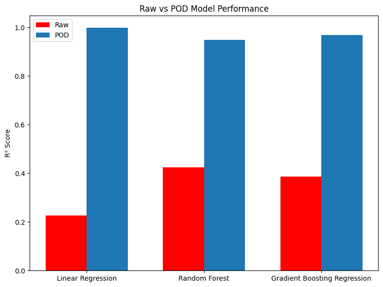
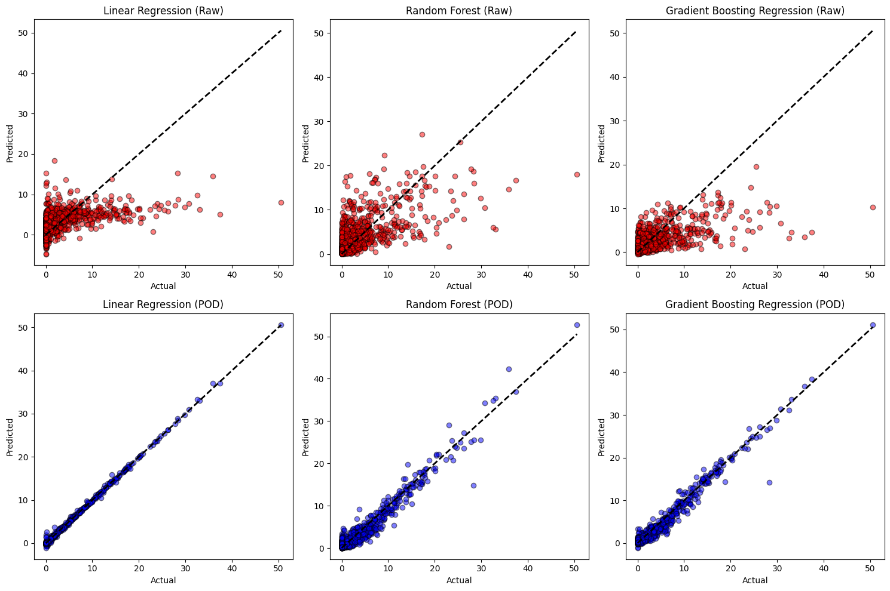

# 🌍 Climate Data Analysis with POD and Machine Learning

## Overview
This project explores the application of **Proper Orthogonal Decomposition (POD)** as a dimensionality reduction technique for climate datasets, followed by **Machine Learning (ML)** regression models to predict climate-related variables.  

The aim is to demonstrate how POD-based reduced-order representations improve model performance compared to raw data training, using temperature, humidity, and precipitation time series.

---

## Methodology

### 1. Data Preparation
- Downloaded daily climate data (2008–2023) from the **NASA POWER API**.  
- Extracted key variables:  
  - **T2M** → Temperature at 2 meters (°C)  
  - **RH2M** → Relative Humidity at 2 meters (%)  
  - **PRECTOTCORR** → Precipitation corrected (mm/day)  
- Constructed a **snapshot matrix** \( X \in \mathbb{R}^{m \times n} \) where:  
  - \( m = 15 \) variables/locations  
  - \( n = 5844 \) daily samples  

---

### 2. Proper Orthogonal Decomposition (POD)
- Applied **Singular Value Decomposition (SVD)**:  
  \[
  X = U \Sigma V^T
  \]  
- Retained **10 dominant modes** to capture most of the system’s variance.  
- Extracted **temporal coefficients** \( C \) from \( V^T \), used as reduced features.  

---

### 3. Machine Learning Models
We trained regression models using both:
1. **Raw dataset (X)**  
2. **POD-reduced dataset (C)**  

Models used:
- **Linear Regression**  
- **Random Forest Regressor**  
- **Gradient Boosting Regressor**  

Performance evaluated with:  
- **Mean Squared Error (MSE)**  
- **Coefficient of Determination (R²)**  

---

### 4. Results
- **POD features** gave **significantly better performance** compared to raw data.  
- Example (single city, one variable as target):  
  - **Raw data R² ≈ 0.2–0.4**  
  - **POD R² ≈ 0.9+**  

📊 **Bar Plot Comparison**  
  

🔍 **Scatter Plot of Predictions vs Ground Truth**  
  

---

## Key Findings
- **POD-based reduced-order modeling** provides a compact, noise-filtered feature space for ML models.  
- Even simple models (e.g., Linear Regression) perform well when trained on POD features.  
- Demonstrates the usefulness of **dimensionality reduction** in handling high-dimensional climate datasets.  

---

## Next Steps
- Extend to **5 different cities** for spatial generalization.  
- Compare with deep learning approaches (e.g., LSTM, Autoencoders).  
- Explore physical interpretability of POD modes.  

---

## Tech Stack
- **Python 3.10+**  
- **NumPy, Pandas, Matplotlib** for data handling and visualization  
- **scikit-learn** for machine learning models  

